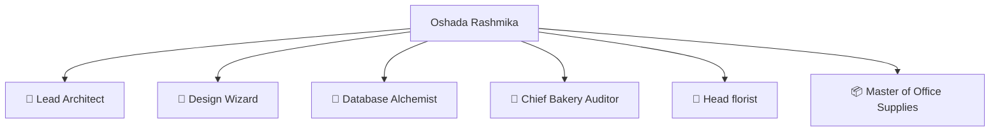

# 👑 The Legends of Wishque IMS 👑

Behind every successful inventory system is a team of dedicated minds. In our case, the entire team, the architectural planning committee, the pixel-perfection design bureau, and the elite chef-de-cuisine is exactly **one person**.

---

## 🦄 The Sole Creator & Architect

### 🥇 Oshada Rashmika
* **Role:** Lead Software Architect, Full-Stack Engineer, Chief UI/UX Designer, Supabase Alchemist, and QA Sentinel.
* **Contributions:** 
  * 💻 Built the Next.js 16 app router infrastructure from scratch.
  * 🎨 Fine-tuned the responsive CSS layout across mobile, tablet, and desktop screens.
  * 🗄️ Masterminded the database schema, foreign key relations, and client-server mutations.
  * 🧁 Integrated the Bakery, Floral, and Stores dashboards under single conditional rendering layers.
  * ⚡ Optimized stock level adjustment steppers and custom logistics tracking systems.
* **Favorite Bakery Ingredient:** Double Chocolate Fudge 🍫
* **Favorite Flower:** Red Roses 🌹
* **Favorite Stationery:** Ultra-smooth Gel Pens 🖊️

---

## 🏆 Title Breakdown

Oshada Rashmika holds all of the following honorary positions in this project:

* **Lead Architect:** Designed the server-action-driven stock mutation system.
* **Design Wizard:** Defined the gorgeous pastel-glow cards (`bg-emerald-500/15`, `bg-amber-500/15`, `bg-blue-500/10`).
* **Database Alchemist:** Concocted the tables, logging systems, and pricing metrics in LKR.
* **Chief Bakery Auditor / Head Florist / Master of Office Supplies:** Kept inventory levels in perfect green safety checklist status.

---

## 🤝 Join the Guild (How to Contribute)

Wishque IMS is currently a solo masterpiece, but if you want to submit a recipe or add a new department, you must follow the strict laws of this kingdom:

1. **Seek Audience with the Architect:** Before writing code, consult with **Oshada Rashmika** to pitch your ideas.
2. **Honor the Pastel Codex:** All user interfaces must adhere to our premium glassmorphic and low-opacity pastel palette guidelines (see [README.md](file:///c:/PROJECTS/wishque-inventory/wishque-ims/README.md)).
3. **No Empty Pots (No Placeholders):** If your component needs a stock item or a visual, configure beautiful and specific Unsplash images.
4. **Alchemical Integrity:** Keep TypeScript types strict, handle errors gracefully with database mutation logging, and ensure pages remain perfectly responsive across all mobile layouts.

---

*Made with passion and precision by Oshada Rashmika.*
