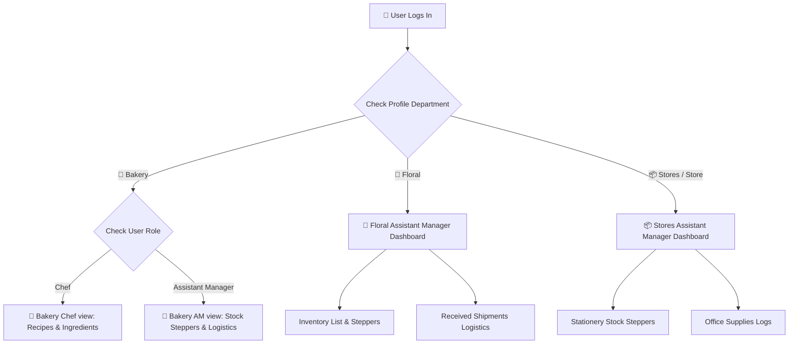

# ✨ Wishque IMS (Inventory Management System) 🧁🌸📦

> **Where Bakery Flour, Blooming Roses, and Stationery Tape live in perfect, real-time database harmony.** 
> Designed with sleek pastel aesthetics and built to keep the cupcakes rising, the flowers fresh, and the office shelves fully stocked.

---

## 🗺️ Quick Navigation

- 🎮 [Interactive System Tour](#-interactive-system-tour)
- 🎭 [Choose Your Character (Role Matrix)](#-choose-your-character-role-matrix)
- 🥞 [The Tech Stack & Architecture](#-the-tech-stack--architecture)
- 🚀 [Launch Checklist (Getting Started)](#-launch-checklist-getting-started)
- 🗄️ [Database Grimoire (Supabase Schema)](#-database-grimoire-supabase-schema)
- 🎨 [Design System & Pastel Tokens](#-design-system--pastel-tokens)
- 🤝 [Contributing Recipes](#-contributing-recipes)

---

## 🎮 Interactive System Tour

Explore the virtual departments of **Wishque IMS**. Click each department card below to uncover its specific operational powers:

<details>
<summary><b>🧁 Bakery Department (Click to expand)</b></summary>
<br />

The heart of our sweet operations. Handles high-precision ingredient management:
* **The Pantry:** Oreos, Strawberries, Flour, Edible Pearls, Baking Powder, Sugar, Butter, Vanilla, Cocoa.
* **Role Routing:** 
  * **Head Chef View:** Accesses recipes and raw material usage. Launches modal overlays to view the exact flour/cocoa requirement for each dessert.
  * **Assistant Manager View:** Controls stock level steppers, logs waste/incoming items, and tracks historical transactions.
* **Pastel Metric Cards:** Quick-status panels highlighting total item diversity, active low-stock alerts, and safety checkups.

</details>

<details>
<summary><b>🌸 Floral Department (Click to expand)</b></summary>
<br />

Keeping the operations fresh and blooming:
* **The Greenhouse:** Red Roses, Pink Roses, White Roses, Orange Roses, Gerbera, Chrysanthemum.
* **Visual Catalogs:** Loaded with high-resolution Unsplash images representing each floral species.
* **Stock Alerts:** Immediate glowing indicators for stems falling below safety margins.
* **Assistant Manager Dashboard:** Dedicated stock steppers and transaction recording.

</details>

<details>
<summary><b>📦 Store/Stationery Department (Click to expand)</b></summary>
<br />

The operational backbone. Supplies packaging and office items to all teams:
* **The Depot:** A4 Paper, Tape, Pens, Notebooks.
* **Logistics Hub:** Real-time log entries, shipment arrivals, and supplier tracking.
* **LKR Cost Tracker:** Calculates total department consumption costs dynamically inside glassmorphic panels.

</details>

---

## 🎭 Choose Your Character (Role Matrix)

The application matches your user role and department to deliver a tailored, secure workspace.

| Role | Allowed Departments | Key Capabilities |
| :--- | :--- | :--- |
| **Chef** | `Bakery` | View inventory, browse product recipes, audit ingredients. |
| **Assistant Manager** | `Bakery`, `Floral`, `Stores` | Modify stock balances, receive new shipments, review logistics journals. |
| **Admin** | Any | System management, audits, overrides, global adjustments. |

### 🛠️ Navigation & Routing flow



---

## 🥞 The Tech Stack & Architecture

Wishque IMS runs on a bleeding-edge modern web architecture:

* **Framework:** [Next.js 16 (App Router)](https://nextjs.org/) utilizing React 19 for seamless server actions.
* **Database & Auth:** [Supabase](https://supabase.com/) for real-time Postgres synchronization and secure cookie-based session token validation.
* **Styling:** [Tailwind CSS v4](https://tailwindcss.com/) for lightning-fast, utility-driven compilation.
* **Icons:** [Lucide React](https://lucide.dev/) for crisp, scalable vectors.
* **UX/Aesthetics:** Custom-designed cards with frosted-glass backdrops (`backdrop-blur-xl`), animated alert banners, and reactive pastel-glow panels.

---

## 🚀 Launch Checklist (Getting Started)

Get your local copy running in minutes!

### 1. Gather the Ingredients (Clone & Install)
```bash
# Clone the repository
git clone https://github.com/oshada-rashmika/wishque-inventory.git
cd wishque-ims

# Install dependencies using pnpm
pnpm install
```

### 2. Configure the Env Crystals
Create a `.env.local` file in the root directory:
```env
NEXT_PUBLIC_SUPABASE_URL=your_supabase_project_url
NEXT_PUBLIC_SUPABASE_ANON_KEY=your_supabase_anon_api_key
```

### 3. Initialize the Database Grimoire
Apply the SQL schema inside your Supabase project editor. Click below to expand the full setup script:

<details>
<summary><b>📐 Click to Expand Supabase SQL Init Script</b></summary>
<br />

```sql
-- Create Profiles table
CREATE TABLE public.profiles (
  id UUID REFERENCES auth.users ON DELETE CASCADE PRIMARY KEY,
  full_name TEXT NOT NULL,
  role TEXT NOT NULL CHECK (role IN ('Chef', 'Assistant Manager', 'Admin')),
  department TEXT NOT NULL CHECK (department IN ('HR', 'Accounts', 'Operations', 'Product Development', 'Bakery', 'Floral', 'Stores', 'Stationery'))
);

-- Enable RLS for Profiles
ALTER TABLE public.profiles ENABLE ROW LEVEL SECURITY;
CREATE POLICY "Allow users to view profiles" ON public.profiles FOR SELECT USING (true);

-- Create Inventory Items table
CREATE TABLE public.inventory_items (
  id UUID PRIMARY KEY DEFAULT gen_random_uuid(),
  name TEXT NOT NULL,
  category TEXT NOT NULL,
  department TEXT NOT NULL,
  current_stock NUMERIC(10,2) NOT NULL DEFAULT 0,
  minimum_threshold NUMERIC(10,2) NOT NULL DEFAULT 0,
  unit TEXT NOT NULL,
  created_at TIMESTAMP WITH TIME ZONE DEFAULT timezone('utc'::text, now()) NOT NULL
);

-- Create Stock Logs table
CREATE TABLE public.stock_logs (
  id UUID PRIMARY KEY DEFAULT gen_random_uuid(),
  item_id UUID REFERENCES public.inventory_items(id) ON DELETE CASCADE NOT NULL,
  quantity_changed NUMERIC(10,2) NOT NULL,
  type TEXT NOT NULL CHECK (type IN ('IN', 'OUT', 'WASTE')),
  user_id UUID REFERENCES auth.users(id) ON DELETE SET NULL,
  department TEXT,
  created_at TIMESTAMP WITH TIME ZONE DEFAULT timezone('utc'::text, now()) NOT NULL
);

-- Create Shipments table
CREATE TABLE public.shipments (
  id UUID PRIMARY KEY DEFAULT gen_random_uuid(),
  item_id UUID REFERENCES public.inventory_items(id) ON DELETE CASCADE NOT NULL,
  quantity NUMERIC(10,2) NOT NULL,
  price NUMERIC(12,2) NOT NULL, -- Stored in LKR
  received_by UUID REFERENCES auth.users(id) ON DELETE SET NULL,
  department TEXT NOT NULL,
  created_at TIMESTAMP WITH TIME ZONE DEFAULT timezone('utc'::text, now()) NOT NULL
);

-- Create Products table (for Bakery/Stores menus)
CREATE TABLE public.products (
  id UUID PRIMARY KEY DEFAULT gen_random_uuid(),
  name TEXT NOT NULL,
  category TEXT,
  department TEXT NOT NULL,
  price NUMERIC(10,2) NOT NULL DEFAULT 0,
  created_at TIMESTAMP WITH TIME ZONE DEFAULT timezone('utc'::text, now()) NOT NULL
);

-- Create Recipes table
CREATE TABLE public.product_recipes (
  id UUID PRIMARY KEY DEFAULT gen_random_uuid(),
  product_id UUID REFERENCES public.products(id) ON DELETE CASCADE NOT NULL,
  ingredient_id UUID REFERENCES public.inventory_items(id) ON DELETE CASCADE NOT NULL,
  quantity_required NUMERIC(10,2) NOT NULL,
  created_at TIMESTAMP WITH TIME ZONE DEFAULT timezone('utc'::text, now()) NOT NULL
);
```

</details>

### 4. Ignite the Hearth (Run Dev Server)
```bash
pnpm run dev
```
Open [http://localhost:3000](http://localhost:3000) in your browser.

---

## 🎨 Design System & Pastel Tokens

The visual language of Wishque IMS follows a clean, glassmorphic layout. The KPI metric cards are colored to provide instant status feedback with soft low-opacity backgrounds:

* **Checklist/Safety card:** Pastel Green (`bg-emerald-500/15 text-emerald-700 dark:text-emerald-300`)
* **Low Stock Alerts card:** Pastel Amber/Yellow (`bg-amber-500/15 text-amber-700 dark:text-amber-300`)
* **Total Items card:** Pastel Blue (`bg-blue-500/10 text-blue-700 dark:text-blue-300`)
* **Low Stock Rows:** Highlighted with subtle borders & amber text glow to ensure managers never miss a shortage.

---

## 🤝 Contributing Recipes

1. Fork this grimoire.
2. Brew your features in a separate branch: `git checkout -b feature/magic-yeast`.
3. Save your progress: `git commit -m "feat: add double chocolate recipe lookup"`.
4. Deploy the scroll: `git push origin feature/magic-yeast`.
5. Open a Pull Request!

---

*Made with 🧁, 🌸, and lots of code by Oshada Rashmika.*
